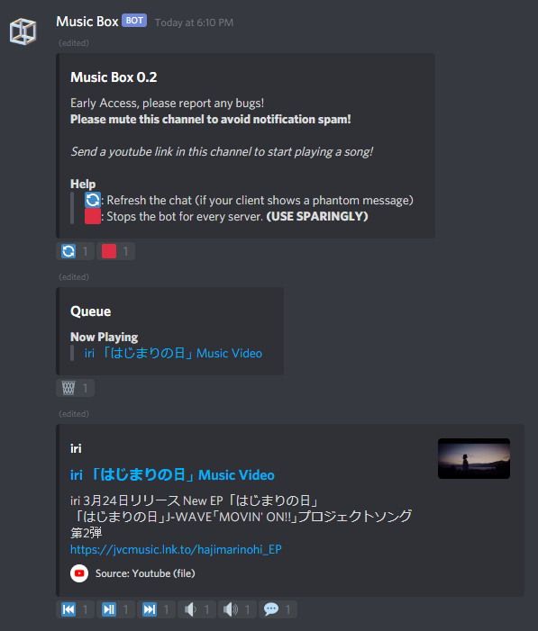
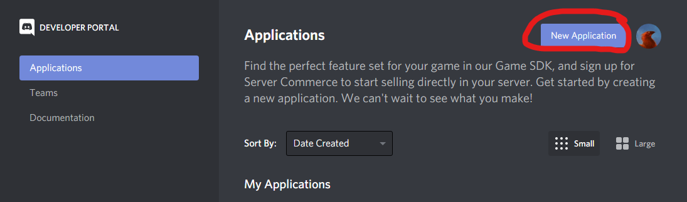
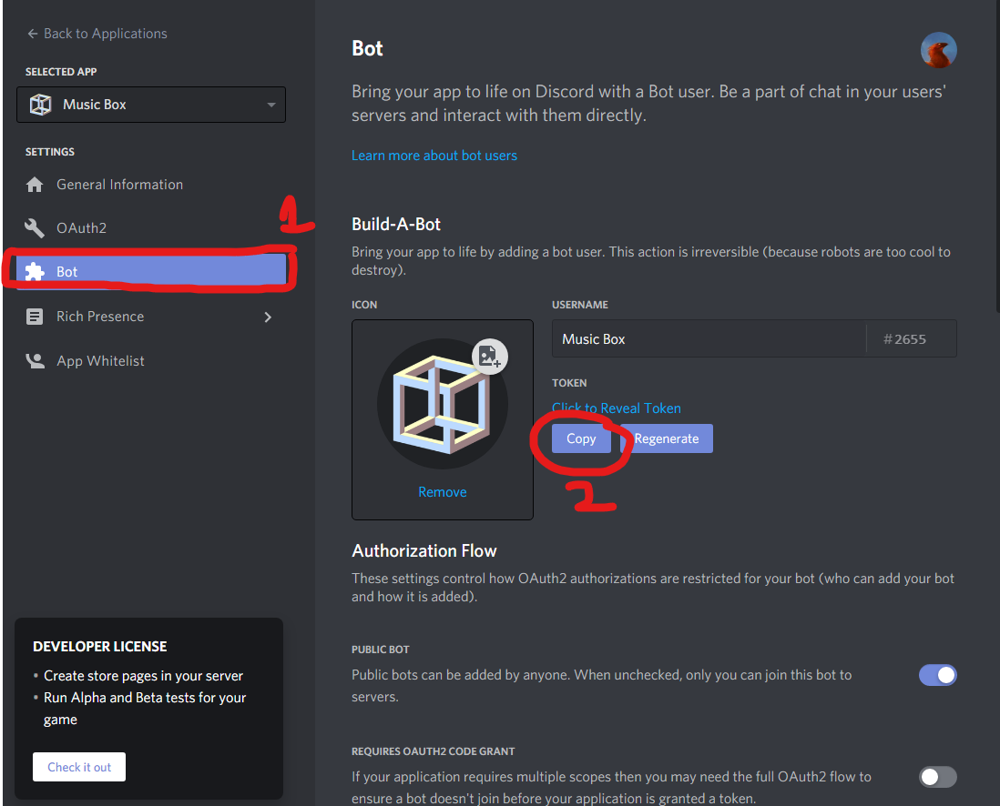
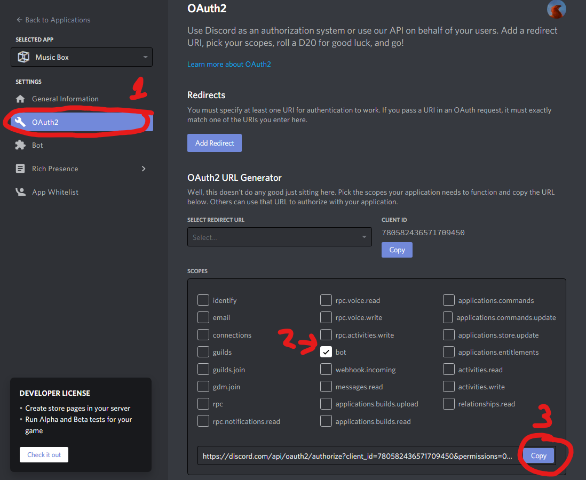

# Music Box
Music Box is a discord streaming bot designed to be easy to use.

Uses SponsorBlock data licensed used under CC BY-NC-SA 4.0. More details: https://sponsor.ajay.app/

**Features:**

- Playing music from Youtube.
- Search Youtube & Youtube Music from the bot.
- Skipping non-music sections of the bot based on [crowdsourced data](https://sponsor.ajay.app/).
- [Discord slash commands](https://blog.discord.com/slash-commands-are-here-8db0a385d9e6)  eg. /play, /pause



## Setup/Installation
1. Install Python 3.7 or greater from https://www.python.org/

2. Clone this repository and navigate to project directory
```bash
git clone https://github.com/borisliao/mbox.git
cd mbox/
```

3. Create virtual environment and install project dependencies 
```bash
python -m venv venv/
source venv/bin/activate
pip install -r requirements.txt
```

4. Install FFmpeg 
    - Navigate to https://ffmpeg.org/download.html
    - Underneath ``Get packages & executable files`` header, download the executable/package of FFmpeg you need for your OS.
    - Create ffmpeg directory underneath root project directory (where requirements.txt file is located)
    - Extract the zip file to ffmpeg directory

5. Install Opus
    - For MacOS users, ``brew install opus``

6. Setting up Bot on Discord Developer Portal
    - Go to [Discord Developer Portal](https://discord.com/developers/applications) 
    - Add new application to Discord account.

    

    - Enter Bot's name. *Recommended name: Music Box*
    - Click on Bot tab.

    - Scroll down to Privileged Gateway Intents and turn on both PRESENCE INTENT and SERVER MEMBERS INTENT.
    
    - Scroll back up to Build-A-Bot and copy token.

    

    - Navigate to src/constants.py and replace TOKEN's value with the copied Discord token.

    - Click on OAuth2 tab.
    - Under Scopes, check off ``bot`` checkbox.
    - Copy bot invitation link.
    
    

    - Paste URL into browser and invite bot to server.

## Usage
*To run application*.
```bash
python main.py
```

*To run application in debug mode*.
```bash
python main.py debug
```

## Issues

* youtube-dl should update automatically during the runtime of this program.

## Contributing
Pull requests are welcome. For major changes, please open an issue first to discuss what you would like to change.

## License
[MIT](https://choosealicense.com/licenses/mit/)
